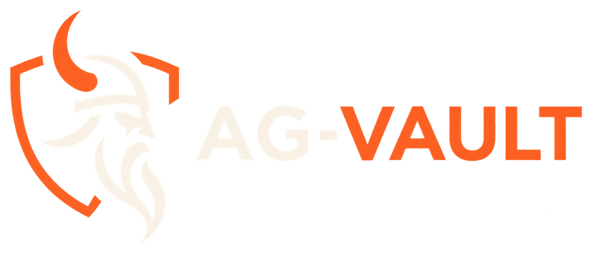

<p align="center">
  
</p>

<h3 align="center">Ultra-fast multi-agent secrets vault</h3>

<p align="center">
  <b>One Go binary</b> · REST API + MCP server + embedded WebUI
</p>

<p align="center">
  <a href="https://github.com/kerviaHerve/AG-VAULT/releases"></a>
  <a href="LICENSE"></a>
  
  
  
</p>

---

- SQLite embedded (pure Go, no CGO), AES-256-GCM at rest
- Per-agent API keys (Argon2id), per-vault grants, immutable versioning, append-only audit
- 51 credential templates (OpenAI, PostgreSQL, SMTP, Cloudflare, GitHub…)
- **Self-update** from the webui — sha256-verified releases, data untouched
- Security by design — AGPL-3.0

## Architecture

One binary, one SQLite file, three surfaces — everything below ships in
a single ~15 MB static executable:

```
                    ┌─────────────────────────────────────────────┐
                    │              agentvault (Go)                 │
                    │                                             │
  agents / AI ────▶ │  /v1/*      REST API   ─┐                   │
  (API key Bearer)  │  /mcp      MCP server  ─┤                   │
                    │             (8 tools)   │                   │
                    │                        ▼                   │
  admin ──────────▶ │  /ui/*  /admin/*  SPA  ─┤   auth            │
  (session cookie)  │             + wizard   │  ┌── Argon2id     │
                    │                        │  │   key verify   │
  GitHub releases ▶ │  self-update           │  │   rate limit   │
  (sha256-checked)  │  (download→verify→swap)│  └   grants       │
                    │                        ▼        │          │
                    │               ┌──────────────┐ │          │
                    │               │  crypto      │◀┘          │
                    │               │  AES-256-GCM │            │
                    │               │  master key  │            │
                    │               └──────┬───────┘            │
                    │                      ▼                    │
                    │               ┌──────────────┐            │
                    │               │ store (SQLite)│            │
                    │               │ agents, vaults│            │
                    │               │ secrets, audit│            │
                    │               └──────────────┘            │
                    └─────────────────────────────────────────────┘

  /v1/*  agent API key ──▶ Argon2id verify ──▶ grant check ──▶ decrypt
  /admin session cookie ─▶ bcrypt verify    ──▶ audit trail
  data at rest: AES-256-GCM per secret · versions immutable · audit append-only
```

## Install — one command (Linux, systemd)

```bash
sudo bash install.sh
```

That's it. The installer:

1. **Asks where to bind** — detects your addresses, highlights VPN ones
   (NetBird/Tailscale), warns in red before any public-IP exposure
2. **Downloads the release binary** from GitHub and verifies its **sha256**
3. Installs a **hardened systemd service** (dedicated user,
   `ProtectSystem=strict`, no root)
4. Opens the **setup wizard** at `http://<bind>:8321/ui/` — pick your
   language → accept the terms → set the admin password → download your
   recovery codes → create your first agent (its API key + a
   ready-to-paste skill for OpenCode/Hermes)

Automated, no prompts:

```bash
AGENTVAULT_BIND=10.0.0.5 AGENTVAULT_PORT=8321 sudo -E bash install.sh
```

Updates: **Settings → Version → Update now** in the webui. The service
downloads the newer release, verifies it, swaps itself and restarts —
your vaults and secrets are never touched.

## Install — Docker alternative

```bash
# generate the master key
openssl rand -hex 32

# generate the admin password hash
docker build -t ag-vault .
docker run --rm ag-vault hashpw 'your-admin-password'

# configure
cat > .env <<EOF
AGENTVAULT_MASTER_KEY=<hex from step 1>
AGENTVAULT_ADMIN_HASH=<hash from step 2>
EOF

# run
docker compose up -d
# webui: http://localhost:8321/ui/ (login with the admin password)
```

## Configuration (environment)

| Variable | Required | Default | Description |
|---|---|---|---|
| `AGENTVAULT_MASTER_KEY` | ✅ | — | 64 hex chars (32 bytes). Server refuses to boot without it. |
| `AGENTVAULT_ADMIN_HASH` | ✅ | — | bcrypt hash of the webui admin password (`agentvault hashpw`). |
| `AGENTVAULT_LISTEN` | | `127.0.0.1:8321` | listen address. |
| `AGENTVAULT_DB` | | `/var/lib/agentvault/agentvault.db` | SQLite path. |
| `AGENTVAULT_RATE_PER_MIN` | | `60` | requests/minute per API key. |

## REST API

Auth: `Authorization: Bearer av_<key>` — key is scoped to the granted vaults.

| Method | Path | Description |
|---|---|---|
| GET | `/v1/whoami` | identity + accessible vaults |
| GET | `/v1/vaults` | vaults |
| GET | `/v1/secrets?vault=<name>` | metadata (no values) |
| GET | `/v1/secrets/{id}` | decrypted value |
| POST | `/v1/secrets` | create — `{vault,key,value}` or `{vault,key,template,values}` |
| PATCH | `/v1/secrets/{id}` | update (new version) |
| DELETE | `/v1/secrets/{id}` | delete |
| GET | `/v1/templates` | all credential templates |
| GET | `/v1/templates/{key}` | one template |

Admin (`/admin/*`, session cookie from `POST /admin/login`): agents (create →
key shown once), vaults, grants, secrets, versions, audit.

## MCP (validated E2E — stdio + HTTP)

Two transports, the same agent-scoped key:

**stdio (OpenCode):**
```bash
opencode mcp add ag-vault --global \
  --env AGENTVAULT_API_KEY=av_... \
  --env AGENTVAULT_MASTER_KEY=<64 hex> \
  --env AGENTVAULT_ADMIN_HASH=<bcrypt> \
  --env AGENTVAULT_DB=/opt/agentvault/data/agentvault.db \
  -- /opt/agentvault/bin/agentvault --mcp-stdio
```

**HTTP (Hermes — any machine that can reach the server, no binary needed):**
```yaml
mcp_servers:
  ag-vault:
    url: https://your-agvault.example.com/mcp   # ← your instance's URL
    headers:
      Authorization: "Bearer av_..."
```

Tools: `list_vaults` · `list_secrets` · `get_secret` · `create_secret` ·
`update_secret` · `delete_secret` · `list_templates` · `whoami`.

Scoping enforced per tool (defense in depth): grants re-verified on
every operation; templated creates validated; templated reads return
structured `values` objects. Skill for agents: `docs/skills/ag-vault/`.
Agent distribution kit: `agvault-agent-kit.zip` (binary + skill + guide).

## Security model

| Threat | Mitigation |
|---|---|
| Key theft | 256-bit CSPRNG keys, Argon2id (m=64MB) stored hashed, constant-time verify, revocation |
| Tampering | AES-256-GCM tags, immutable versioning |
| Insider/eavesdropping | append-only audit log, secrets never in lists/logs, values revealed only on explicit action |
| Brute force | per-key rate limiting, failed logins audited |
| Escalation | grants re-verified in every handler (defense in depth), deny by default |

Threat model: no client-side E2E (self-hosted trust), TLS terminated by the
reverse proxy, encryption at rest protects DB file exfiltration.

## Development

```bash
go test -race ./...
gosec ./...
govulncheck ./...
```

Layout: `cmd/agentvault` · `internal/{crypto,store,auth,api,mcp,templates,web,model,config}` ·
`migrations` · `web` (embedded).

## License

AGPL-3.0-or-later — see [LICENSE](LICENSE) (full text).

Copyright (C) 2026 kervia

This program is free software: you can redistribute it and/or modify
it under the terms of the GNU Affero General Public License as
published by the Free Software Foundation, either version 3 of the
License, or (at your option) any later version.

This program is distributed in the hope that it will be useful, but
WITHOUT ANY WARRANTY; without even the implied warranty of
MERCHANTABILITY or FITNESS FOR A PARTICULAR PURPOSE. See the GNU
Affero General Public License for more details.

Binary releases: the corresponding source is this repository (the tag
you downloaded). Build it with `cd web-app && npm ci && npx vite build`
then `go build ./cmd/agentvault` — same commands the CI runs.